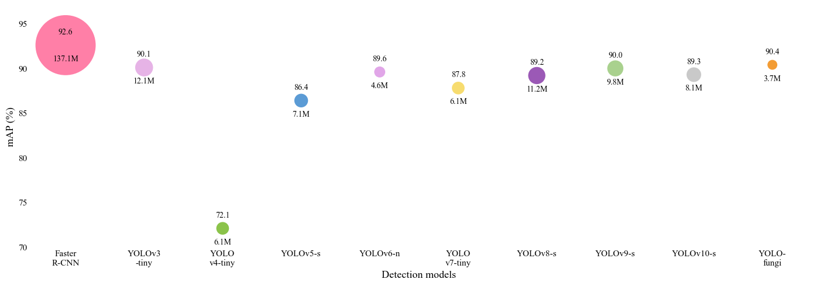
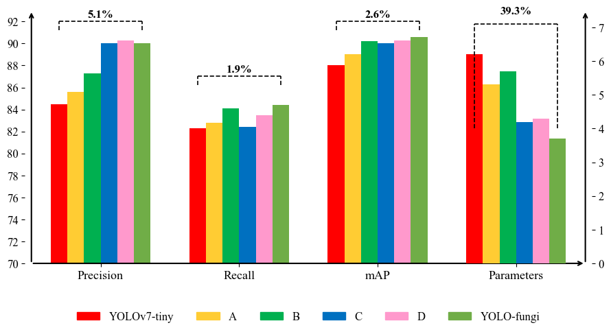
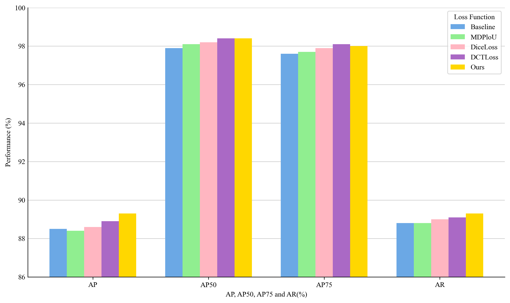
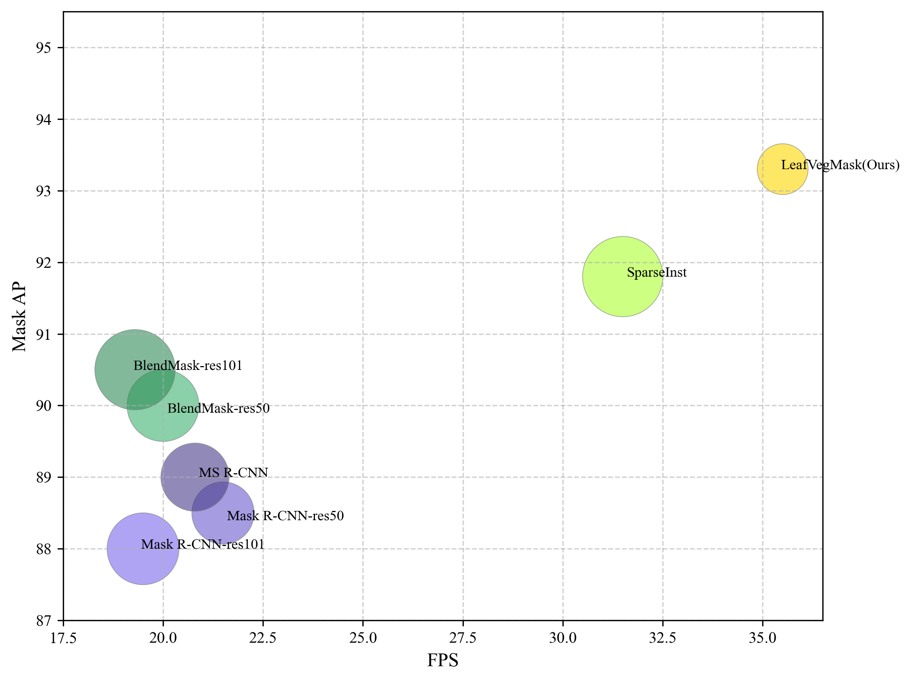
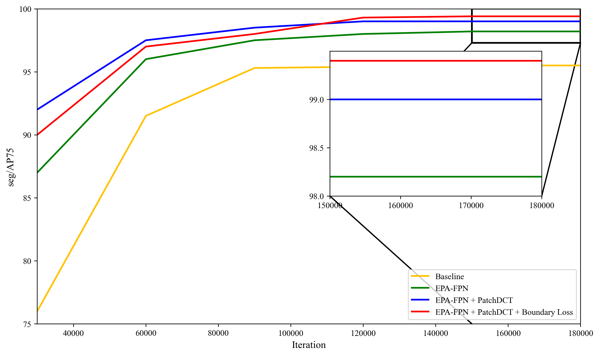
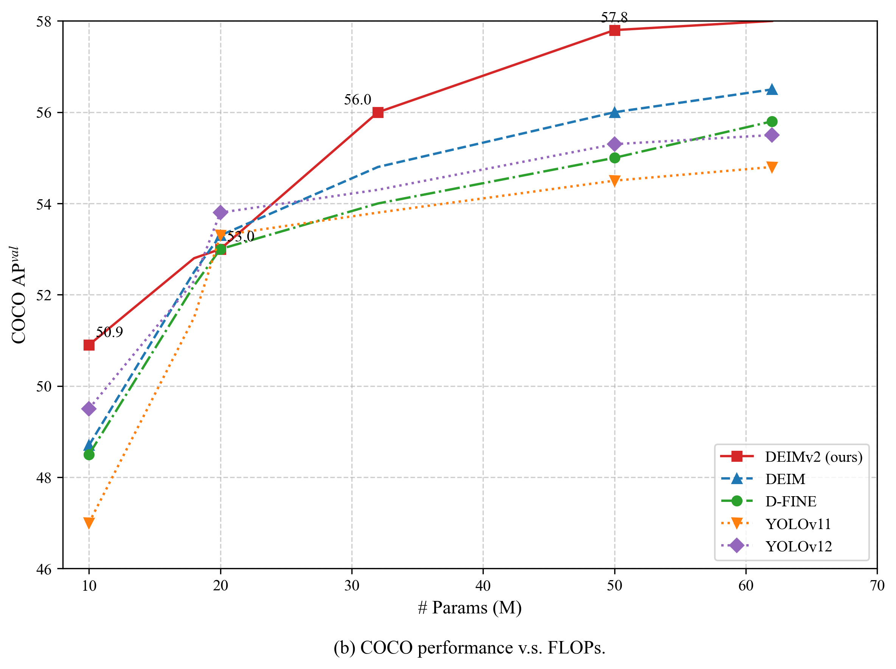
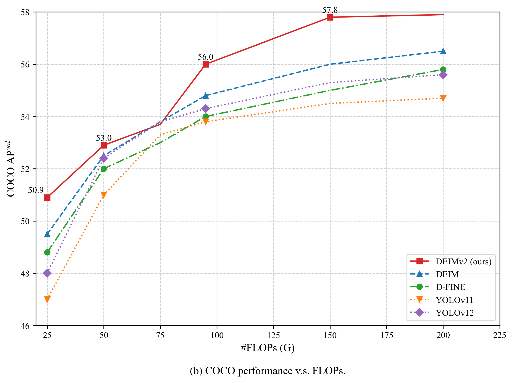

```python
import matplotlib.pyplot as plt
import matplotlib as mpl
import numpy as np

# ----------------------------
# 字体：Times New Roman（论文级）
# ----------------------------
mpl.rcParams['font.family'] = 'Times New Roman'
mpl.rcParams['mathtext.fontset'] = 'stix'
mpl.rcParams['axes.unicode_minus'] = False

# ----------------------------
# 数据（来自原图）
# ----------------------------
models = [
    "Faster\nR-CNN",
    "YOLOv3\n-tiny",
    "YOLO\nv4-tiny",
    "YOLOv5-s",
    "YOLOv6-n",
    "YOLO\nv7-tiny",
    "YOLOv8-s",
    "YOLOv9-s",
    "YOLOv10-s",
    "YOLO-\nfungi"
]

map_values = [92.6, 90.1, 72.1, 86.4, 89.6, 87.8, 89.2, 90.0, 89.3, 90.4]
params = [137.1, 12.1, 6.1, 7.1, 4.6, 6.1, 11.2, 9.8, 8.1, 3.7]

x = np.arange(len(models))

# ----------------------------
# 气泡大小
# ----------------------------
size_scale = 40
sizes = [p * size_scale for p in params]

# ----------------------------
# 颜色（接近原图）
# ----------------------------
colors = [
    "#ff7fa7",
    "#e6b3e6",
    "#8bc34a",
    "#5b9bd5",
    "#e1a6e8",
    "#f7dc6f",
    "#9b59b6",
    "#a9d18e",
    "#c9c9c9",
    "#f39c34"
]

# ----------------------------
# 绘图
# ----------------------------
plt.figure(figsize=(14, 5))

plt.scatter(
    x, map_values,
    s=sizes,
    c=colors,
    edgecolors="none"
)

# ----------------------------
# 文本标注
# ----------------------------
for i, (m, p) in enumerate(zip(map_values, params)):
    plt.text(i, m + 1.2, f"{m}", ha="center", fontsize=10)
    plt.text(i, m - 1.8, f"{p}M", ha="center", fontsize=10)

# ----------------------------
# 坐标轴
# ----------------------------
plt.xticks(x, models, fontsize=11)
plt.yticks(np.arange(70, 100, 5), fontsize=11)
plt.ylim(70, 97)

plt.ylabel("mAP (%)", fontsize=13)
plt.xlabel("Detection models", fontsize=13)

# ----------------------------
# 箭头坐标轴
# ----------------------------
ax = plt.gca()
for spine in ax.spines.values():
    spine.set_visible(False)

ax.tick_params(axis='both', length=0)

ax.annotate(
    "", xy=(len(models)-0.3, 70), xytext=(-0.5, 70),
    arrowprops=dict(arrowstyle="->", linewidth=1.5)
)

ax.annotate(
    "", xy=(-0.5, 97), xytext=(-0.5, 70),
    arrowprops=dict(arrowstyle="->", linewidth=1.5)
)

plt.tight_layout()
plt.show()

```


    

    


```python
import matplotlib.pyplot as plt
import matplotlib as mpl
import numpy as np

# =========================
# 全局字体：Times New Roman
# =========================
mpl.rcParams['font.family'] = 'Times New Roman'
mpl.rcParams['mathtext.fontset'] = 'stix'
mpl.rcParams['axes.unicode_minus'] = False

# =========================
# 数据（按图中估计值精确复刻）
# =========================
labels = ['Precision', 'Recall', 'mAP', 'Parameters']

YOLOv7_tiny = [84.5, 82.3, 88.0, 6.2]
A = [85.6, 82.8, 89.0, 5.3]
B = [87.3, 84.1, 90.2, 5.7]
C = [90.0, 82.4, 90.0, 4.2]
D = [90.3, 83.5, 90.3, 4.3]
YOLO_fungi = [90.0, 84.4, 90.6, 3.7]

data = [YOLOv7_tiny, A, B, C, D, YOLO_fungi]

colors = ['#ff0000', '#ffcc33', '#00b050',
          '#0070c0', '#ff99cc', '#70ad47']

names = ['YOLOv7-tiny', 'A', 'B', 'C', 'D', 'YOLO-fungi']

# =========================
# 位置参数
# =========================
x = np.arange(len(labels))
width = 0.12
offsets = np.linspace(-2.5*width, 2.5*width, 6)

# =========================
# 创建图形
# =========================
fig, ax1 = plt.subplots(figsize=(9, 5))

# =========================
# 左轴（三个指标）
# =========================
for i in range(6):
    ax1.bar(x[:3] + offsets[i], data[i][:3],
            width=width, color=colors[i])

ax1.set_ylim(70, 93)
ax1.set_yticks(np.arange(70, 94, 2))
ax1.set_xticks(x)
ax1.set_xticklabels(labels, fontsize=13)
ax1.tick_params(axis='y', labelsize=12)

# =========================
# 右轴（Parameters）
# =========================
ax2 = ax1.twinx()
for i in range(6):
    ax2.bar(x[3] + offsets[i], data[i][3],
            width=width, color=colors[i])

ax2.set_ylim(0, 7.5)
ax2.set_yticks(np.arange(0, 8, 1))
ax2.tick_params(axis='y', labelsize=12)

# =========================
# 虚线提升标注
# =========================
# def dashed_improve(ax, x_start, x_end, y, text):
#     ax.plot([x_start, x_end], [y, y], '--', color='black', linewidth=1.2)
#     ax.plot([x_start, x_start], [y-0.8, y], '--', color='black', linewidth=1.2)
#     ax.plot([x_end, x_end], [y-0.8, y], '--', color='black', linewidth=1.2)
#     ax.annotate(text, ((x_start+x_end)/2, y+0.4),
#                 ha='center', fontsize=12, fontweight='bold')

# Precision
dashed_improve(ax1,
               x[0] + offsets[0],
               x[0] + offsets[-1],
               92, '5.1%')

# Recall
dashed_improve(ax1,
               x[1] + offsets[0],
               x[1] + offsets[-1],
               87, '1.9%')

# mAP
dashed_improve(ax1,
               x[2] + offsets[0],
               x[2] + offsets[-1],
               92, '2.6%')

# Parameters（右轴）
ax2.plot([x[3] + offsets[0], x[3] + offsets[-1]],
         [7.1, 7.1], '--', color='black', linewidth=1.2)
ax2.plot([x[3] + offsets[0], x[3] + offsets[0]],
         [4.0, 7.1], '--', color='black', linewidth=1.2)
ax2.plot([x[3] + offsets[-1], x[3] + offsets[-1]],
         [4.0, 7.1], '--', color='black', linewidth=1.2)
ax2.annotate('39.3%',
             (x[3], 7.4),
             ha='center', fontsize=12, fontweight='bold')

# =========================
# 坐标轴箭头
# =========================
for spine in ax1.spines.values():
    spine.set_visible(False)
for spine in ax2.spines.values():
    spine.set_visible(False)

ax1.annotate('', xy=(3.5, 70), xytext=(-0.5, 70),
             arrowprops=dict(arrowstyle='->', linewidth=1.5))
ax1.annotate('', xy=(-0.5, 93), xytext=(-0.5, 70),
             arrowprops=dict(arrowstyle='->', linewidth=1.5))
ax2.annotate('', xy=(3.5, 7.5), xytext=(3.5, 0),
             arrowprops=dict(arrowstyle='->', linewidth=1.5))

# =========================
# 图例
# =========================
handles = [plt.Rectangle((0, 0), 1, 1, color=c) for c in colors]
ax1.legend(handles, names, ncol=6,
           loc='upper center',
           bbox_to_anchor=(0.5, -0.15),
           frameon=False, fontsize=12)

plt.tight_layout()
plt.show()

```


    

    


```python
import matplotlib.pyplot as plt
import numpy as np
import pandas as pd

# 设置字体为 Times New Roman
plt.rcParams['font.family'] = 'Times New Roman'
plt.rcParams['font.size'] = 10  # 调整全局字体大小以适应图表

# 1. 估算数据 (近似值)
# 损失函数/方法: Baseline, MDPloU, DiceLoss, DCTLoss, Ours
# 指标: AP, AP50, AP75, AR
data = {
    'Baseline': [88.5, 97.9, 97.6, 88.8],
    'MDPloU': [88.4, 98.1, 97.7, 88.8],
    'DiceLoss': [88.6, 98.2, 97.9, 89.0],
    'DCTLoss': [88.9, 98.4, 98.1, 89.1],
    'Ours': [89.3, 98.4, 98.0, 89.3], # Ours 在 AP 和 AR 上略高
}

df = pd.DataFrame(data, index=['AP', 'AP50', 'AP75', 'AR'])
df = df.T # 转置，使损失函数为行，指标为列

# 2. 设置绘图参数
metrics = df.columns
methods = df.index
n_methods = len(methods)
n_metrics = len(metrics)
bar_width = 0.15 # 柱子的宽度
spacing = 0.25 # 指标组之间的额外空间

# 3. 计算柱子位置
# 针对每个指标组 (AP, AP50, AP75, AR)，计算每种方法的柱子中心位置
base_x = np.arange(n_metrics) * (n_methods * bar_width + spacing)
x = np.array([base_x + i * bar_width for i in range(n_methods)])

# 4. 设置颜色 (近似原图颜色)
colors = {
    'Baseline': '#6BA8E5',  # 蓝色
    'MDPloU': '#90EE90',    # 浅绿色
    'DiceLoss': '#FFB6C1',  # 浅粉色 (比原图略亮)
    'DCTLoss': '#AA69C5',   # 紫色
    'Ours': '#FFD700',      # 金色/黄色
}

# 5. 创建图表
fig, ax = plt.subplots(figsize=(10, 6), dpi=300) # 设置 DPI 为 300

# 绘制柱状图
for i, method in enumerate(methods):
    ax.bar(x[i], df.loc[method], bar_width, label=method, color=colors[method], edgecolor='none') # 移除边框

# 6. 图表样式设置
# 设置 x 轴刻度标签为 'AP', 'AP50', 'AP75', 'AR'
# 刻度位置取每组柱子的中心
mean_x_pos = base_x + (n_methods * bar_width - bar_width) / 2
ax.set_xticks(mean_x_pos)
ax.set_xticklabels(metrics)

# 设置 y 轴范围和刻度
ax.set_ylim(86, 100)
ax.set_yticks(np.arange(86, 102, 2))
ax.tick_params(axis='y', length=0) # 移除 y 轴刻度线

# 添加 y 轴标签 (原图中的 'Loss Function' 可能是误写，这里改用更合适的标题)
ax.set_ylabel('Performance (%)')

# 设置 x 轴标签
ax.set_xlabel('AP, AP50, AP75 and AR(%)')

# 添加图例
ax.legend(title='Loss Function', loc='upper right', frameon=True)

# 移除顶部和右侧边框
ax.spines['right'].set_visible(False)
ax.spines['top'].set_visible(False)

# 在 86, 88, 90, 92... 处添加水平网格线（原图只有刻度线，这里保留刻度线）
ax.grid(axis='y', linestyle='-', alpha=0.4, color='gray')
ax.set_axisbelow(True) # 让网格线在柱子后面

# 标题（可选，原图没有）
# plt.title('Comparison of Different Loss Functions')

# 调整布局
plt.tight_layout()

# 保存图片 (可选)
# plt.savefig('replicated_bar_chart.png', dpi=300)

plt.show()
```


    

    


```python
import matplotlib.pyplot as plt
import numpy as np
import pandas as pd

# 设置字体为 Times New Roman
plt.rcParams['font.family'] = 'Times New Roman'
plt.rcParams['font.size'] = 10 # 调整全局字体大小以适应图表

# 1. 估算数据 (近似值)
# Model: Name, FPS (X), Mask AP (Y), Size (S, 用于气泡大小), Color (C)
data = [
    {'Model': 'Mask R-CNN-res101', 'FPS': 19.5, 'Mask AP': 88.0, 'Size': 2000, 'Color': '#7B68EE', 'Label_Offset': (-0.05, 0.05)},
    {'Model': 'Mask R-CNN-res50', 'FPS': 21.5, 'Mask AP': 88.5, 'Size': 1500, 'Color': '#6A5ACD', 'Label_Offset': (0.1, -0.05)},
    {'Model': 'MS R-CNN', 'FPS': 20.8, 'Mask AP': 89.0, 'Size': 1800, 'Color': '#483D8B', 'Label_Offset': (0.1, 0.05)},
    {'Model': 'BlendMask-res50', 'FPS': 20.0, 'Mask AP': 90.0, 'Size': 2000, 'Color': '#3CB371', 'Label_Offset': (0.1, -0.05)},
    {'Model': 'BlendMask-res101', 'FPS': 19.3, 'Mask AP': 90.5, 'Size': 2500, 'Color': '#2E8B57', 'Label_Offset': (-0.05, 0.05)},
    {'Model': 'SparseInst', 'FPS': 31.5, 'Mask AP': 91.8, 'Size': 2500, 'Color': '#ADFF2F', 'Label_Offset': (0.1, 0.05)},
    {'Model': 'LeafVegMask(Ours)', 'FPS': 35.5, 'Mask AP': 93.3, 'Size': 1000, 'Color': '#FFD700', 'Label_Offset': (-0.05, 0.05)},
]

df = pd.DataFrame(data)

# 2. 创建图表
fig, ax = plt.subplots(figsize=(8, 6), dpi=300) # 设置 DPI 为 300

# 绘制气泡图
# alpha 设置气泡透明度，以显示重叠
scatter = ax.scatter(
    df['FPS'],
    df['Mask AP'],
    s=df['Size'], # 气泡大小
    c=df['Color'], # 气泡颜色
    alpha=0.6,
    edgecolors='gray', # 可选：添加边缘颜色
    linewidths=0.5
)

# 3. 添加模型名称标签
for index, row in df.iterrows():
    # 调整标签位置以避免遮挡气泡中心
    x_offset, y_offset = row['Label_Offset']
    ax.text(
        row['FPS'] + x_offset,
        row['Mask AP'] + y_offset,
        row['Model'],
        fontsize=9,
        ha='left',
        va='center',
        fontname='Times New Roman'
    )

# 4. 图表样式设置
# 设置轴标签
ax.set_xlabel('FPS', fontsize=12)
ax.set_ylabel('Mask AP', fontsize=12)

# 设置 x 轴和 y 轴范围 (略大于数据范围，与原图近似)
ax.set_xlim(17.5, 36.5)
ax.set_ylim(87, 95.5)

# 设置刻度
ax.set_xticks(np.arange(17.5, 37.5, 2.5))
ax.set_yticks(np.arange(87, 96, 1))

# 添加虚线网格 (与原图一致)
ax.grid(True, linestyle='--', alpha=0.6)

# 调整布局
plt.tight_layout()

# 保存图片 (可选)
# plt.savefig('replicated_bubble_chart.png', dpi=300)

plt.show()
```


    

    


```python
import matplotlib.pyplot as plt
import numpy as np

# 设置字体为 Times New Roman
plt.rcParams['font.family'] = 'Times New Roman'
plt.rcParams['font.size'] = 10 # 调整全局字体大小以适应图表

# 1. 估算数据 (近似值)
# 迭代次数 (X轴)
iterations = np.array([30000, 60000, 90000, 120000, 150000, 180000])

# 性能 (Y轴): seg/AP75
# 近似曲线数据
data = {
    'Baseline': [76.0, 91.5, 95.3, 95.4, 95.5, 95.5],  # 黄色
    'EPA-FPN': [87.0, 96.0, 97.5, 98.0, 98.2, 98.2],   # 绿色
    'EPA-FPN + PatchDCT': [92.0, 97.5, 98.5, 99.0, 99.0, 99.0], # 蓝色
    'EPA-FPN + PatchDCT + Boundary Loss': [90.0, 97.0, 98.0, 99.3, 99.4, 99.4] # 红色
}

# 颜色映射
colors = {
    'Baseline': '#FFC300',  # 橙/黄色
    'EPA-FPN': '#008000',   # 绿色
    'EPA-FPN + PatchDCT': '#0000FF', # 蓝色
    'EPA-FPN + PatchDCT + Boundary Loss': '#FF0000' # 红色
}

methods = list(data.keys())

# 2. 创建主图和子图
fig, ax1 = plt.subplots(figsize=(10, 6), dpi=300) # 设置 DPI 为 300

# 绘制主图曲线
for method in methods:
    ax1.plot(iterations, data[method], label=method, color=colors[method], linewidth=2)

# 3. 主图样式设置
ax1.set_xlabel('Iteration', fontsize=12)
ax1.set_ylabel('seg/AP75', fontsize=12)

# 设置 X 轴刻度和范围
ax1.set_xlim(30000, 180000)
ax1.set_xticks(np.arange(40000, 180001, 20000))
ax1.ticklabel_format(axis='x', style='plain') # 避免科学计数法

# 设置 Y 轴刻度和范围
ax1.set_ylim(75, 100)
ax1.set_yticks(np.arange(75, 101, 5))

# 添加图例
ax1.legend(loc='lower right', frameon=True)

# 4. 创建局部放大子图 (Inset Axes)
# 定义子图位置 [left, bottom, width, height] (相对于主图的比例)
ax_ins = fig.add_axes([0.55, 0.45, 0.35, 0.4])

# 绘制子图曲线
for method in methods:
    # 只取放大部分的数据点 (从 150000 迭代开始)
    idx_start = np.where(iterations >= 150000)[0][0]
    
    # 绘制水平线 (放大区域数据近似为水平)
    ax_ins.hlines(data[method][idx_start], 150000, 180000, 
                  color=colors[method], linewidth=2)

# 5. 子图样式设置
# 设置子图 X 轴范围
ax_ins.set_xlim(150000, 180000)
ax_ins.set_xticks(np.arange(150000, 180001, 10000))

# 设置子图 Y 轴范围
ax_ins.set_ylim(98.0, 99.5) # 调整 Y 轴范围以匹配原图的缩放
ax_ins.set_yticks([98.0, 98.5, 99.0]) # 根据原图刻度微调

# 移除子图的轴标签
ax_ins.set_xlabel('')
ax_ins.set_ylabel('')

# 6. 添加连接线 (Connecting Lines)
from matplotlib.patches import ConnectionPatch

# 定义主图上放大区域的四个角 (左下，左上，右下，右上)
# 左下角
xyA_left = (150000, ax1.get_ylim()[0])
xyB_left = (ax_ins.get_xlim()[0], ax_ins.get_ylim()[0])
con1 = ConnectionPatch(xyA=xyA_left, xyB=xyB_left, coordsA="data", coordsB="data", 
                       axesA=ax1, axesB=ax_ins, color="black", linewidth=1.5,
                       linestyle="-")
ax1.add_artist(con1)

# 右上角
xyA_right = (180000, ax1.get_ylim()[1])
xyB_right = (ax_ins.get_xlim()[1], ax_ins.get_ylim()[1]) # 使用主图的 Y 上限是为了确保连接线覆盖整个范围
con2 = ConnectionPatch(xyA=(180000, 97.3), xyB=(180000, 99.5), coordsA="data", coordsB="data", 
                       axesA=ax1, axesB=ax_ins, color="black", linewidth=1.5,
                       linestyle="-")

# 绘制一个黑色矩形框，将放大区域框选起来
rect_x = 150000
rect_y_bottom = 97.3 # 估算矩形底部在主图上的位置
rect_width = 180000 - rect_x
rect_height = 100 - rect_y_bottom # 估算矩形高度

from matplotlib.patches import Rectangle
rect = Rectangle((rect_x, rect_y_bottom), rect_width, rect_height, 
                 edgecolor='black', facecolor='none', linewidth=2)
ax1.add_patch(rect)


# 重新绘制连接线，使其连接矩形框和子图框 (更符合原图风格)
# 左下角连接线
con1 = ConnectionPatch(xyA=(150000, rect_y_bottom), xyB=(ax_ins.get_xlim()[0], ax_ins.get_ylim()[0]), 
                       coordsA="data", coordsB="data", axesA=ax1, axesB=ax_ins, 
                       color="black", linewidth=1.5)
ax1.add_artist(con1)

# 右下角连接线
con2 = ConnectionPatch(xyA=(180000, rect_y_bottom), xyB=(ax_ins.get_xlim()[1], ax_ins.get_ylim()[0]), 
                       coordsA="data", coordsB="data", axesA=ax1, axesB=ax_ins, 
                       color="black", linewidth=1.5)
ax1.add_artist(con2)


# 调整布局
plt.tight_layout(rect=[0, 0, 1, 1]) # 避免子图被裁切

# 保存图片 (可选)
plt.savefig('replicated_curve_chart_with_inset.png', dpi=300)

plt.show()
```

    C:\Users\white\AppData\Local\Temp\ipykernel_2276\2182903660.py:126: UserWarning: This figure includes Axes that are not compatible with tight_layout, so results might be incorrect.
      plt.tight_layout(rect=[0, 0, 1, 1]) # 避免子图被裁切
    


    

    


```python
import matplotlib.pyplot as plt
import numpy as np
import pandas as pd

# 设置字体为 Times New Roman
plt.rcParams['font.family'] = 'Times New Roman'
plt.rcParams['font.size'] = 10 # 调整全局字体大小以适应图表

# 1. 估算数据 (近似值)
# 估算每个模型在几个关键参数量点上的 AP 值

# 参数量 (M) - 关键的 X 轴点
params_m = [10, 18, 20, 32, 50, 62]

# 性能 (Y轴): COCO AP^val
data = {
    # DEIMv2 (ours) - 红色实线，方形标记
    'DEIMv2 (ours)': [50.9, 52.8, 53.0, 56.0, 57.8, 58.0],
    # DEIM - 蓝色虚线，三角形标记
    'DEIM': [48.7, 52.5, 53.3, 54.8, 56.0, 56.5],
    # D-FINE - 绿色点划线，圆形标记
    'D-FINE': [48.5, 52.2, 53.0, 54.0, 55.0, 55.8],
    # YOLOv11 - 橙色虚线，向下三角形标记
    'YOLOv11': [47.0, 51.5, 53.3, 53.8, 54.5, 54.8],
    # YOLOv12 - 紫色虚线，菱形标记
    'YOLOv12': [49.5, 52.3, 53.8, 54.3, 55.3, 55.5],
}

df = pd.DataFrame(data, index=params_m)

# 线条样式配置
styles = {
    'DEIMv2 (ours)': {'color': 'tab:red', 'linestyle': '-', 'marker': 's', 'markersize': 6, 'markevery': [0, 2, 3, 4]},
    'DEIM': {'color': 'tab:blue', 'linestyle': '--', 'marker': '^', 'markersize': 6, 'markevery': [0, 2, 4, 5]},
    'D-FINE': {'color': 'tab:green', 'linestyle': '-.', 'marker': 'o', 'markersize': 6, 'markevery': [0, 2, 4, 5]},
    'YOLOv11': {'color': 'tab:orange', 'linestyle': ':', 'marker': 'v', 'markersize': 6, 'markevery': [0, 2, 4, 5]},
    'YOLOv12': {'color': 'tab:purple', 'linestyle': ':', 'marker': 'D', 'markersize': 6, 'markevery': [0, 2, 4, 5]},
}

# 2. 创建图表
fig, ax = plt.subplots(figsize=(8, 6), dpi=300) # 设置 DPI 为 300

# 3. 绘制曲线
for model in df.columns:
    style = styles[model]
    ax.plot(df.index, df[model], label=model, **style)

# 4. 标注关键数据点 (仅标注原图上明确标出的数值)
# 标注 DEIMv2 的三个点
ax.text(df.index[0] + 0.5, df['DEIMv2 (ours)'].iloc[0] + 0.1, '50.9', fontsize=10, ha='left', va='bottom')
ax.text(df.index[2] + 0.5, df['DEIMv2 (ours)'].iloc[2] + 0.1, '53.0', fontsize=10, ha='left', va='bottom')
ax.text(df.index[3] - 0.5, df['DEIMv2 (ours)'].iloc[3] + 0.1, '56.0', fontsize=10, ha='right', va='bottom')
ax.text(df.index[4], df['DEIMv2 (ours)'].iloc[4] + 0.1, '57.8', fontsize=10, ha='center', va='bottom')


# 5. 图表样式设置
ax.set_xlabel('# Params (M)\n\n(b) COCO performance v.s. FLOPs.', fontsize=12)
ax.set_ylabel('COCO AP$^{val}$', fontsize=12)

# 设置 X 轴范围和刻度
ax.set_xlim(8, 70)
ax.set_xticks(np.arange(10, 71, 10))

# 设置 Y 轴范围和刻度
ax.set_ylim(46, 58)
ax.set_yticks(np.arange(46, 59, 2))

# 添加虚线网格
ax.grid(True, linestyle='--', alpha=0.6)

# 添加图例
# 调整图例位置，使其位于右下角且不与曲线重叠
ax.legend(loc='lower right', frameon=True)

# 调整布局
plt.tight_layout()

# 保存图片 (可选)
# plt.savefig('replicated_coco_ap_vs_params_chart.png', dpi=300)

plt.show()
```


    

    


```python
import matplotlib.pyplot as plt
import numpy as np
import pandas as pd

# 设置字体为 Times New Roman
plt.rcParams['font.family'] = 'Times New Roman'
plt.rcParams['font.size'] = 10 # 调整全局字体大小以适应图表

# 1. 估算数据 (近似值)
# 估算每个模型在几个关键 FLOPs 点上的 AP 值

# FLOPs (G) - 关键的 X 轴点
flops_g = [25, 50, 75, 95, 150, 200]

# 性能 (Y轴): COCO AP^val
data = {
    # DEIMv2 (ours) - 红色实线，方形标记
    # 数值与上一张Params图中的AP值高度相似，但在FLOPs上的分布略有不同
    'DEIMv2 (ours)': [50.9, 52.9, 53.7, 56.0, 57.8, 57.9],
    # DEIM - 蓝色虚线，三角形标记
    'DEIM': [49.5, 52.5, 53.8, 54.8, 56.0, 56.5],
    # D-FINE - 绿色点划线，圆形标记
    'D-FINE': [48.8, 52.0, 53.0, 54.0, 55.0, 55.8],
    # YOLOv11 - 橙色虚线，向下三角形标记
    'YOLOv11': [47.0, 51.0, 53.3, 53.8, 54.5, 54.7],
    # YOLOv12 - 紫色虚线，菱形标记
    'YOLOv12': [48.0, 52.4, 53.8, 54.3, 55.3, 55.6],
}

df = pd.DataFrame(data, index=flops_g)

# 线条样式配置
styles = {
    'DEIMv2 (ours)': {'color': 'tab:red', 'linestyle': '-', 'marker': 's', 'markersize': 6, 'markevery': [0, 1, 3, 4]},
    'DEIM': {'color': 'tab:blue', 'linestyle': '--', 'marker': '^', 'markersize': 6, 'markevery': [0, 1, 3, 5]},
    'D-FINE': {'color': 'tab:green', 'linestyle': '-.', 'marker': 'o', 'markersize': 6, 'markevery': [0, 1, 3, 5]},
    'YOLOv11': {'color': 'tab:orange', 'linestyle': ':', 'marker': 'v', 'markersize': 6, 'markevery': [0, 1, 3, 5]},
    'YOLOv12': {'color': 'tab:purple', 'linestyle': ':', 'marker': 'D', 'markersize': 6, 'markevery': [0, 1, 3, 5]},
}

# 2. 创建图表
fig, ax = plt.subplots(figsize=(8, 6), dpi=300) # 设置 DPI 为 300

# 3. 绘制曲线
for model in df.columns:
    style = styles[model]
    ax.plot(df.index, df[model], label=model, **style)

# 4. 标注关键数据点 (仅标注原图上明确标出的数值)
# 标注 DEIMv2 的四个点
ax.text(df.index[0] - 5, df['DEIMv2 (ours)'].iloc[0] + 0.1, '50.9', fontsize=10, ha='center', va='bottom')
ax.text(df.index[1], df['DEIMv2 (ours)'].iloc[1] + 0.1, '53.0', fontsize=10, ha='center', va='bottom')
ax.text(df.index[3], df['DEIMv2 (ours)'].iloc[3] + 0.1, '56.0', fontsize=10, ha='center', va='bottom')
ax.text(df.index[4], df['DEIMv2 (ours)'].iloc[4] + 0.1, '57.8', fontsize=10, ha='center', va='bottom')

# 5. 图表样式设置
ax.set_xlabel('#FLOPs (G)\n\n(b) COCO performance v.s. FLOPs.', fontsize=12)
ax.set_ylabel('COCO AP$^{val}$', fontsize=12)

# 设置 X 轴范围和刻度
ax.set_xlim(20, 225)
ax.set_xticks(np.arange(25, 226, 25))

# 设置 Y 轴范围和刻度
ax.set_ylim(46, 58)
ax.set_yticks(np.arange(46, 59, 2))

# 添加虚线网格
ax.grid(True, linestyle='--', alpha=0.6)

# 添加图例
# 调整图例位置，使其位于右下角且不与曲线重叠
ax.legend(loc='lower right', frameon=True)

# 调整布局
plt.tight_layout()

# 保存图片 (可选)
# plt.savefig('replicated_coco_ap_vs_flops_chart.png', dpi=300)

plt.show()
```


    

    


```python

```
